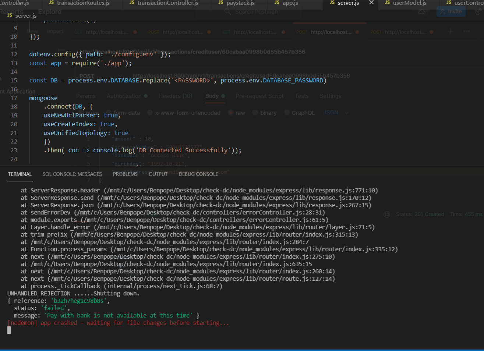

# Ewallet application

This backend application that users signup, login, get all users, get a user by id, update a user detail, forget password, reset password, delete a user, credit a user wallet and debit a user wallet API  using Express and MongoDB.
This collection contains sample requests from this [API](http://localhost:8000/api/v1)

It contains the following routes

• Signup a user (POST) [/users/signup](http://localhost:8000/api/v1/users/signup)

• Login a user with given credentials (POST) [/users/login](http://localhost:8000/api/v1/users/login)

• Get all user (GET) [/users](http://localhost:8000/api/v1/users/)

• Get a user by ID (GET) [/users/:id](http://localhost:8000/api/v1/users/:id)

• Update a user by ID (PATCH) [/users/:id](http://localhost:8000/api/v1/users/:id)

• Forget password a user by ID (POST) [/users/forgetPassword](http://localhost:8000/api/v1/users/forgetPassword)

• Reset password a user by ID (POST) [/users/resetPassword/:token](http://localhost:8000/api/v1/users/resetPassword/:token)

• Delete a user by ID (DELETE) [/users/:id](http://localhost:8000/api/v1/users/:id)

• Credit ewallet (POST) [/transaction/credituser/:userId](http://localhost:8000/api/v1/transactions/credituser/:userId)

• Debit ewallet (POST) [/transaction/debituser/:userId](http://localhost:8000/api/v1/transactions/debituser/:userId)

• Get all transaction (GET) [/transaction](http://localhost:8000/api/v1/transactions)

• Get a transaction by Id (GET) [/transaction/:id](http://localhost:8000/api/v1/transactions/:id)

• Delete a transaction (DELETE) [/transaction/:id](http://localhost:8000/api/v1/transactions/:id)

# signup route

• EndPoint "/users/signup"

• Request type: POST

• payload: name, email, password, confirmPassword

# login route

• EndPoint "/users/login"

• Request type: POST

• payload :  email, password

# get all users route

• EndPoint "/users"

• Request type: GET

# get a user by ID route

• EndPoint "/users/:id"

• Request type: GET

# update a user by ID route

• EndPoint "/users/:id"

• Request type: PATCH

# forget password route

• EndPoint "/users/forgetPassword"

• Request type: POST

• payload: email

• Sends an email with a reset link to the email

# reset password route

• EndPoint "/users/resetPassword/:token"

• Request type: POST

• payload: password, confirmPassword

# delete a user route

• EndPoint "/users/:id"

• Request type: DELETE

# credit ewallet route

• EndPoint "/transactions/credituser/:userId"

• payload : amount, accountNumber, bankName, birthday, emailAddress

• Request type: POST

# debit ewallet route

• EndPoint "/transactions/debituser/:userId"

• payload : accountNumber, bankName, amount

• Request type: POST

# get all transactions route

• EndPoint "/transactions"

• Request type: GET

# get a transaction by id route

• EndPoint "/transactions/:id"

• Request type: GET

# delete a transaction

• EndPoint "/transactions/:id"

• Request type: DELETE

• The error paystack throws from trying to use the charge api. seems they have little issues with it.

[Link to the API documentation with sample requests](https://documenter.getpostman.com/view/9775449/TzY6AEzc)